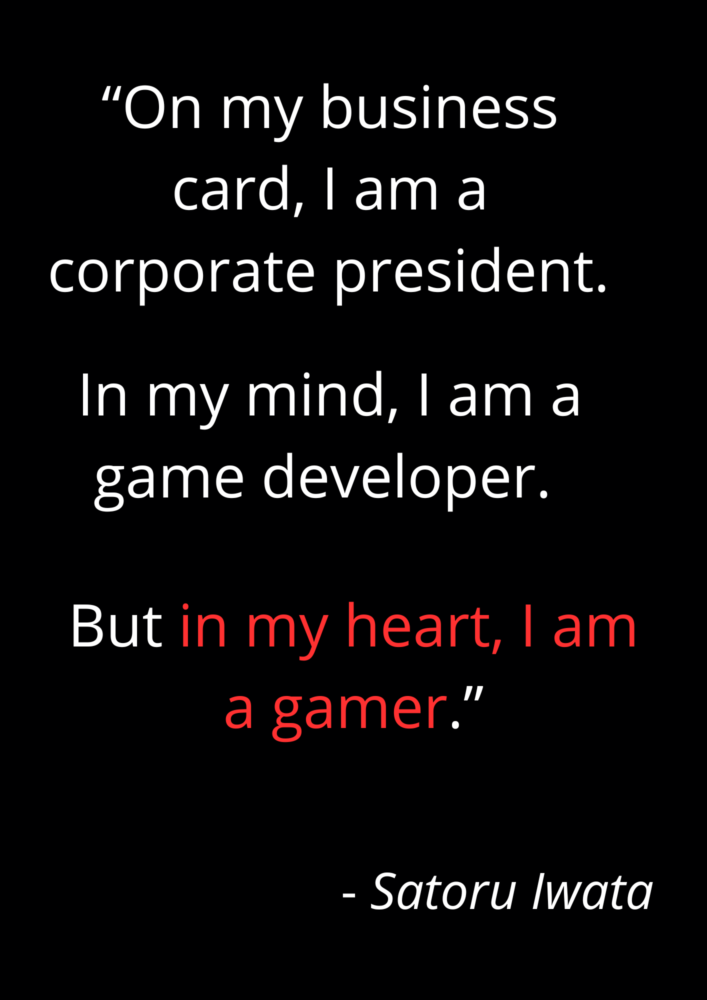

  <h1>😊 Come on in! Take a peek at my GitHub.</h1> 
  

<!--
**RuuRoger/RuuRoger** is a ✨ _special_ ✨ repository because its `README.md` (this file) appears on your GitHub profile.
-->

---

### 🚀 About me

I'm passionate about software and video game development, specializing in Unity and .NET. I seek the perfect harmony between mechanics, design, and narrative, demonstrating that creativity stems from logic and good strategy—a lesson that my studies in mathematics reinforced.

My experience in data analyst has taught me to think critically about business logic, creating solutions that are not only robust and optimized but also strategic and purposeful.

---

### 💻 Languages
|   |   |   |   |
|:-:|:--|:-:|:--|
| 🟣 | C#      | ➕ | C/C++    |
| 💡 | HLSL    | 🐘 | PHP    |
| 📐 | XAML     | 🌐 | HTML |
| 🎨 | CSS     | 🗄️ | SQL      |
| 🐍 | Python  | 📊 | VBA      |

---

### 🛠️ Tools

#### 🎮 Game & Graphics Development

* **🎮 Unity**
* **🎮 Unreal Engine**
* **🎨 Blender**
* **✨ LibreSprite**

#### 🏗️ Frameworks

* **⚙️ .NET**
  * 🌐 ASP.NET Core
  * 🖥️ WPF
* **📘 Bootstrap**

#### 💻 IDEs & Development Environments

* **🚀 Visual Studio**
* **📝 VS Code**
* **📊 Jupyter**

#### 🗄️ Database & Data Visualization

* **🗄️ SQL Server**
* **🐬 MYSQL**
* **🦭 Maria DB**
* **📈 Power BI**

#### 🔗 Version Control

* **⚙️ Git**
* **⚙️ Subversion**

---
### Thanks for checking out my profile! Let's connect or collaborate.
