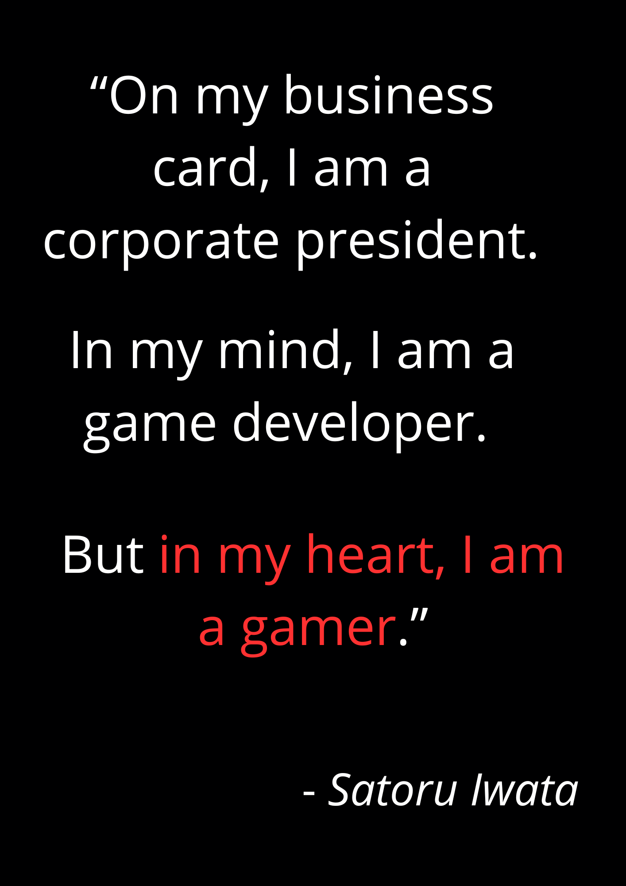

  <h1>😊 Come on in! Take a peek at my GitHub.</h1> 
  

<!--
**RuuRoger/RuuRoger** is a ✨ _special_ ✨ repository because its `README.md` (this file) appears on your GitHub profile.
-->

---

### 🚀 About me

Software Developer focused on Backend Engineering and Interactive Systems (Game Dev), specializing in the .NET ecosystem and Unity. My approach centers on technical control and efficiency, which has led me to dive deep into high-performance languages such as C++, Go, and Java.

I am a firm believer in multidisciplinary growth; I explore fields like Frontend, Cybersecurity, QA, and Microcontrollers not just out of curiosity, but to provide a comprehensive technical vision that ensures secure, testable, and optimized software from the ground up.

---

### 💻 Languages
|   |   |   |   |
|:-:|:--|:-:|:--|
| 🟣 | C#      | ➕ | C/C++    |
| 💡 | HLSL    | ☕️ | Java    |
| 🦫 | GO     | 🌐 | HTML |
| 🎨 | CSS     | 🗄️ | SQL      |
| 🐍 | Python  | 🟠 | Javascript  |

---

### 🛠️ Tools

#### 🎮 Game & Graphics Development

* **🎮 Unity**
* **🎮 Unreal Engine**
* **🎨 Blender**
* **✨ LibreSprite**

#### 🏗️ Frameworks

* **⚙️ .NET**
  * 🌐 ASP.NET Core
  * 🖥️ WPF

#### 💻 IDEs & Development Environments

* **🚀 Visual Studio**
* **📝 VS Code**
* **📊 Jupyter**

#### 🗄️ Database & Data Visualization

* **🗄️ SQL Server**
* **🪶 SQLite**
* **🐘 PostgreSQL**
* **📈 Power BI**

#### 🔗 Version Control

* **⚙️ Git**
* **⚙️ Subversion**

---
### Thanks for checking out my profile! Let's connect or collaborate.
