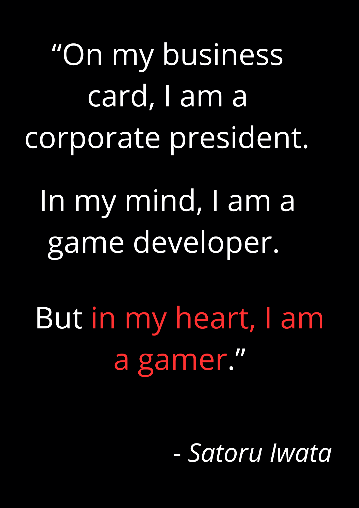

  <h1><i>Software Developer & Game Dev</i></h1> 
  

<!--
**RuuRoger/RuuRoger** is a ✨ _special_ ✨ repository because its `README.md` (this file) appears on your GitHub profile.
-->

---

He podido trabajar con herramientas de moda como **Python** hasta herramientas más de nicho como **Verse** o **VBA**. Tengo una base sólida que me permite adaptarme a cualquier herramienta que se requiera, pero como preferencia personal, presento el stack con el que me siento más cómodo a día de hoy:

- **Go**: Me siento más identificado con él por su filosofía manual, explícito y trabajar sin sobreingeniería . 

- **C#**: El primer lenguaje que aprendí "de verdad". Rey de la productividad con lo mejor de los lenguajes de ingeniería. Siempre tendrá un espacio en mi stack.

- **C++**: Leyenda viva. El más "divertido". En mi stack sí o sí, para llegar a ser el dev que quiero ser.

- **HLSL**: Me fascina.

- **Python**: Valoro su poder para automatizaciones y scripting, aunque su estilo y filosofía de diseño se alejan de mi forma de entender y estructurar el software.
  
- **SQL**: La herramienta de todo buen backend. Prefiero diseñar modelos relacionales limpios y escribir consultas expresivas antes que delegarlo todo a capas de abstracción pesadas.

---

Actualmente, para describir mi forma de trabajar, estos son los **criterios técnicos que suelo asumir en mi día a día** por el tipo de problemas que me enfrento hoy:

**ARQUITECTURA**:
<ul>
  <li>MVC</li>
  <li>Orientado a componentes</li>
</ul>

**PATRONES DE DISEÑO**:

   - Pipeline

   - Repositorio

   - Mediador
  
   - Observer
 
   - Máquina de estados (con DI)

   - s̶i̶n̶g̶l̶e̶t̶o̶n̶, (Soy de los que piensa que mejor no, incluso para videojuegos. Busco con lo que pretende resolver con DI)

**METODOLOGÍAS Y BUENAS PRÁCTICAS**

   - DI (Obvio)

   - SOLID

   - TDD

   - Gestión de configuración centralizada

### **Y MÁS A "BAJO NIVEL..."**

Me apasiona construir software, tanto en el trabajo como por hobby. Pese a que me etiqueto y me esfuerzo por crecer en el backend y los videojuegos, disfruto aprendiendo otras ramas como front, ESP32 (robótica/hardware), mobile, escritorio... sumándome a lo que me quiero enfocar.

Sé que tengo una buena base, pero sigo formándome diariamente para conseguir crecer mis habilidades y capacidades. **Tengo mucho código que picar, mucho código que revisar, muchos patrones y arquitecturas que aprender, pero también estoy orgulloso de lo que puedo construir hoy**.

Si has llegado hasta aquí, he pasado tus test unitarios y quieres pasar al de integración, no dudes en contactarme ☺️
